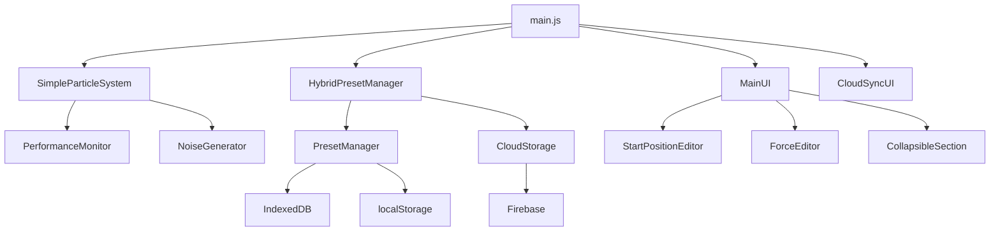

# Particle Life Synth - Developer Documentation

A comprehensive developer guide for the Particle Life Synth project, following MDN documentation standards. This guide covers architecture, APIs, components, and practical development workflows.

---

## Table of Contents

- [Getting Started](#getting-started)
- [Architecture Overview](#architecture-overview)
- [Core Systems](#core-systems)
- [API Reference](#api-reference)
- [Component Guide](#component-guide)
- [Development Workflows](#development-workflows)
- [Testing & Debugging](#testing--debugging)
- [Performance Guidelines](#performance-guidelines)
- [Compatibility & Browser Support](#compatibility--browser-support)

---

## Getting Started

### Prerequisites

```javascript
// Browser compatibility
- ES6+ modules support
- Canvas 2D API support  
- IndexedDB support
- Local storage support
```

### Quick Setup

```bash
# Clone repository
git clone <your-repo-url>
cd particle-life-synth

# Start development server
python3 serve.py

# Access application
open http://localhost:8000
```

### Project Structure

```
particle-life-synth/
├── src/
│   ├── core/                    # Core physics engine
│   │   └── SimpleParticleSystem.js
│   ├── ui/                      # UI components
│   │   ├── MainUI.js           # Main interface controller
│   │   ├── PresetModal.js      # Preset management UI
│   │   ├── StartPositionEditor.js  # Visual position editor
│   │   └── ForceEditor.js      # Force relationship editor
│   ├── utils/                   # Utility modules
│   │   ├── HybridPresetManager.js  # Hybrid storage system
│   │   ├── CloudStorage.js     # Firebase integration
│   │   └── PerformanceMonitor.js   # Performance tracking
│   ├── config/                  # Configuration
│   │   └── firebase.config.js  # Firebase settings
│   └── main.js                 # Application entry point
├── test-suite.html             # Comprehensive testing
├── debug-tools.html            # Development debugging
└── performance-test.html       # Performance profiling
```

---

## Architecture Overview

### Design Principles

The Particle Life Synth follows these core architectural principles:

- **Vanilla JavaScript**: No framework dependencies, pure ES6 modules
- **Modular Design**: Separation of concerns with clear interfaces
- **Canvas-First**: Hardware-accelerated 2D rendering
- **Hybrid Storage**: Local-first with cloud sync capability
- **Progressive Enhancement**: Core functionality works without cloud features

### System Architecture



### Data Flow

```javascript
// Typical data flow pattern
User Input → UI Component → State Manager → Core System → Canvas Render
     ↓
Preset System → Storage Layer → Cloud Sync (optional)
```

---

## Core Systems

### Particle Physics Engine

The `SimpleParticleSystem` class is the heart of the simulation, managing particle behaviors, forces, and rendering.

#### Core Concepts

**Particles**
```javascript
// Particle structure
{
  x: number,          // X position (0 to canvas.width)
  y: number,          // Y position (0 to canvas.height)
  vx: number,         // X velocity
  vy: number,         // Y velocity  
  species: number,    // Species ID (0-based)
  size: number,       // Particle radius
  age: number         // Time alive (for effects)
}
```

**Species Configuration**
```javascript
// Species properties
{
  color: string,      // Hex color (#rrggbb)
  count: number,      // Number of particles
  size: number,       // Base particle size
  mobility: number,   // Movement multiplier
  inertia: number,    // Resistance to change
  trailIntensity: number  // Trail rendering strength
}
```

**Force Relationships**
```javascript
// Force matrix (NxN where N = species count)
forceMatrix = [
  [0.1, -0.5, 0.3],   // Species 0 forces to 0,1,2
  [0.2, 0.1, -0.4],   // Species 1 forces to 0,1,2
  [-0.3, 0.4, 0.0]    // Species 2 forces to 0,1,2
]
// Positive = attraction, Negative = repulsion
```

#### Key Methods

**`constructor(width, height)`**

Creates a new particle system instance.

```javascript
const particleSystem = new SimpleParticleSystem(800, 600);
```

**Parameters:**
- `width` (number): Canvas width in pixels
- `height` (number): Canvas height in pixels

---

**`addSpecies(config)`**

Adds a new species to the simulation.

```javascript
particleSystem.addSpecies({
  color: '#ff0000',
  count: 100,
  size: 3,
  mobility: 1.0,
  inertia: 0.95,
  trailIntensity: 0.8
});
```

**Parameters:**
- `config` (Object): Species configuration object

**Returns:**
- `number`: Species index (0-based)

---

**`update(deltaTime)`**

Updates particle positions and behaviors.

```javascript
// Called each frame
particleSystem.update(16.67); // ~60 FPS
```

**Parameters:**
- `deltaTime` (number): Time elapsed since last update (milliseconds)

---

**`render(ctx, options)`**

Renders particles to canvas context.

```javascript
particleSystem.render(canvasContext, {
  showTrails: true,
  showGlow: false,
  blur: 0.95
});
```

**Parameters:**
- `ctx` (CanvasRenderingContext2D): Canvas rendering context
- `options` (Object): Rendering options

---

### Preset Management System

The preset system uses a hybrid approach combining local storage with optional cloud synchronization.

#### HybridPresetManager

**`constructor()`**

Creates a new hybrid preset manager.

```javascript
const presetManager = new HybridPresetManager();
await presetManager.initialize();
```

---

**`savePreset(name, config)`**

Saves a preset configuration.

```javascript
await presetManager.savePreset('My Preset', {
  species: [...],
  forces: [...],
  globalParams: {...}
});
```

**Parameters:**
- `name` (string): Preset name (will create new if changed)
- `config` (Object): Complete system configuration

**Returns:**
- `Promise<boolean>`: Success status

---

**`loadPreset(name)`**

Loads a preset configuration.

```javascript
const config = await presetManager.loadPreset('My Preset');
particleSystem.applyConfig(config);
```

**Parameters:**
- `name` (string): Preset name to load

**Returns:**
- `Promise<Object>`: Preset configuration

---

**`enableCloudSync()`**

Enables cloud synchronization features.

```javascript
await presetManager.enableCloudSync();
// Now supports real-time collaboration
```

**Returns:**
- `Promise<void>`: Resolves when cloud sync is active

---

### UI Component System

The UI system is built with modular, reusable components that maintain separation of concerns.

#### MainUI

The primary interface controller managing all user interactions.

**`constructor(particleSystem, presetManager)`**

Creates the main UI controller.

```javascript
const mainUI = new MainUI(particleSystem, presetManager);
```

**Parameters:**
- `particleSystem` (SimpleParticleSystem): Core physics engine
- `presetManager` (HybridPresetManager): Preset management system

---

**`initialize()`**

Sets up UI event handlers and initial state.

```javascript
await mainUI.initialize();
```

**Returns:**
- `Promise<void>`: Resolves when UI is ready

---

#### StartPositionEditor

Visual editor for particle starting positions with mathematical distribution patterns.

**Available Distribution Patterns:**
- `uniform`: Random uniform distribution
- `circle`: Circular arrangement
- `spiral`: Fibonacci spiral
- `fractal`: Fractal recursion pattern
- `golden`: Golden ratio distribution
- `quantum`: Quantum interference simulation
- `neural`: Neural network noise
- `temporal`: Time-based distortion

```javascript
// Using distribution patterns
editor.setDistributionPattern('spiral', {
  spiralDensity: 0.8,
  spiralTightness: 1.2,
  centerOffset: { x: 0.5, y: 0.5 }
});
```

---

#### ForceEditor

Matrix-based editor for inter-species force relationships.

**`setForcePreset(presetName)`**

Applies predefined force patterns.

```javascript
forceEditor.setForcePreset('predator-prey');
```

**Available Presets:**
- `clusters`: Orbital clustering behavior
- `predator-prey`: Hunt/escape dynamics
- `territorial`: Boundary defense patterns
- `symbiotic`: Cooperative relationships
- `cyclic`: Rock-paper-scissors cycles

---

### Cloud Storage System

Firebase-based cloud storage enabling real-time collaboration and preset sharing.

#### CloudStorage

**`initialize()`**

Initializes Firebase connection.

```javascript
await cloudStorage.initialize();
```

**Returns:**
- `Promise<void>`: Resolves when connected

---

**`savePreset(preset)`**

Saves preset to cloud storage.

```javascript
await cloudStorage.savePreset({
  name: 'Shared Preset',
  config: {...},
  status: 'public',
  userId: 'anonymous_user_123'
});
```

**Parameters:**
- `preset` (Object): Preset data with metadata

**Returns:**
- `Promise<string>`: Preset document ID

---

**`subscribeToPresets(callback, filters)`**

Subscribes to real-time preset updates.

```javascript
const unsubscribe = cloudStorage.subscribeToPresets(
  (presets) => {
    console.log('Updated presets:', presets);
  },
  { status: 'public' }
);
```

**Parameters:**
- `callback` (Function): Called when presets update
- `filters` (Object): Filter criteria

**Returns:**
- `Function`: Unsubscribe function

---

## API Reference

### SimpleParticleSystem API

#### Properties

| Property | Type | Description |
|----------|------|-------------|
| `width` | number | Canvas width |
| `height` | number | Canvas height |
| `particles` | Array | Current particles |
| `species` | Array | Species configurations |
| `forceMatrix` | Array | Inter-species forces |
| `globalParams` | Object | Global simulation parameters |

#### Methods

| Method | Parameters | Returns | Description |
|--------|------------|---------|-------------|
| `constructor` | width, height | SimpleParticleSystem | Creates new instance |
| `addSpecies` | config | number | Adds species, returns index |
| `removeSpecies` | index | void | Removes species |
| `setForceMatrix` | matrix | void | Updates force relationships |
| `update` | deltaTime | void | Updates simulation |
| `render` | ctx, options | void | Renders to canvas |
| `reset` | - | void | Resets simulation |
| `getMetrics` | - | Object | Returns performance metrics |

### Utility Functions

#### Value Conversions

The system uses specific value ranges for different parameters:

```javascript
// Friction conversion (UI to physics)
function convertFriction(uiValue) {
  // UI: 0.0-0.2 → Physics: 1.0-0.8
  return 1.0 - uiValue;
}

// Blur conversion (trail effect)  
function convertBlur(uiValue) {
  // Range: 0.5-0.99 (higher = shorter trails)
  return Math.max(0.5, Math.min(0.99, uiValue));
}

// Force strength normalization
function normalizeForce(value) {
  // Range: -3.0 to +3.0
  return Math.max(-3.0, Math.min(3.0, value));
}
```

#### Color Utilities

```javascript
// Hex to RGB conversion
function hexToRgb(hex) {
  const result = /^#?([a-f\d]{2})([a-f\d]{2})([a-f\d]{2})$/i.exec(hex);
  return result ? {
    r: parseInt(result[1], 16),
    g: parseInt(result[2], 16),
    b: parseInt(result[3], 16)
  } : null;
}

// Color interpolation for backgrounds
function interpolateColor(color1, color2, factor) {
  const c1 = hexToRgb(color1);
  const c2 = hexToRgb(color2);
  
  return {
    r: Math.round(c1.r + (c2.r - c1.r) * factor),
    g: Math.round(c1.g + (c2.g - c1.g) * factor),
    b: Math.round(c1.b + (c2.b - c1.b) * factor)
  };
}
```

---

## Component Guide

### Creating Custom UI Components

Follow this pattern for new UI components:

```javascript
export class CustomComponent {
  constructor(parentElement, options = {}) {
    this.parent = parentElement;
    this.options = { ...this.defaultOptions, ...options };
    this.element = null;
    this.eventListeners = [];
  }

  get defaultOptions() {
    return {
      className: 'custom-component',
      enabled: true
    };
  }

  createElement() {
    this.element = document.createElement('div');
    this.element.className = this.options.className;
    
    // Build UI structure
    this.element.innerHTML = `
      <div class="component-header">
        <h3>Custom Component</h3>
      </div>
      <div class="component-content">
        <!-- Component content -->
      </div>
    `;
    
    return this.element;
  }

  attachEventListeners() {
    const button = this.element.querySelector('.action-button');
    
    const clickHandler = (event) => {
      this.handleClick(event);
    };
    
    button.addEventListener('click', clickHandler);
    this.eventListeners.push({ element: button, event: 'click', handler: clickHandler });
  }

  handleClick(event) {
    // Handle user interaction
    this.emit('action', { data: 'example' });
  }

  emit(eventName, data) {
    const event = new CustomEvent(eventName, { detail: data });
    this.element.dispatchEvent(event);
  }

  destroy() {
    // Clean up event listeners
    this.eventListeners.forEach(({ element, event, handler }) => {
      element.removeEventListener(event, handler);
    });
    this.eventListeners = [];
    
    // Remove from DOM
    if (this.element && this.element.parentNode) {
      this.element.parentNode.removeChild(this.element);
    }
  }
}
```

### Component Integration

```javascript
// Create and integrate component
const customComponent = new CustomComponent(parentElement, options);
const element = customComponent.createElement();
customComponent.attachEventListeners();

// Listen for component events
element.addEventListener('action', (event) => {
  console.log('Component action:', event.detail);
});

// Add to DOM
parentElement.appendChild(element);
```

### Collapsible Sections

Use the `CollapsibleSection` component for expandable UI areas:

```javascript
import { CollapsibleSection } from './ui/CollapsibleSection.js';

const section = new CollapsibleSection({
  title: 'Advanced Options',
  expanded: false,
  className: 'advanced-section'
});

const element = section.createElement();
const content = section.getContentElement();

// Add content to the collapsible area
content.appendChild(yourContentElement);

parentElement.appendChild(element);
```

---

## Development Workflows

### Local Development

```bash
# Start development server
python3 serve.py

# Access development URLs
echo "Main app: http://localhost:8000"
echo "Test suite: http://localhost:8000/test-suite.html"
echo "Debug tools: http://localhost:8000/debug-tools.html"
echo "Performance: http://localhost:8000/performance-test.html"
```

### Making Changes

1. **Core Physics**: Edit `src/core/SimpleParticleSystem.js`
2. **UI Components**: Modify files in `src/ui/`
3. **Storage Systems**: Update `src/utils/` modules
4. **Styling**: Edit `src/styles/design-system.css`

### Adding New Features

```javascript
// 1. Core functionality
class NewFeature {
  constructor(particleSystem) {
    this.particleSystem = particleSystem;
  }

  initialize() {
    // Feature setup
  }

  update(deltaTime) {
    // Per-frame updates
  }
}

// 2. UI integration  
class NewFeatureUI {
  constructor(feature) {
    this.feature = feature;
  }

  createElement() {
    // Create UI controls
  }

  attachEventListeners() {
    // Handle user input
  }
}

// 3. Integration in main.js
import { NewFeature } from './features/NewFeature.js';
import { NewFeatureUI } from './ui/NewFeatureUI.js';

// Initialize in main application
const newFeature = new NewFeature(particleSystem);
const newFeatureUI = new NewFeatureUI(newFeature);
```

### Preset Development

```javascript
// Create new preset
const newPreset = {
  name: 'Custom Behavior',
  species: [
    { color: '#ff0000', count: 100, size: 3 },
    { color: '#00ff00', count: 50, size: 5 }
  ],
  forces: [
    [0.1, -0.5],   // Species 0 → 0,1
    [0.3, 0.2]     // Species 1 → 0,1  
  ],
  globalParams: {
    friction: 0.98,
    speed: 1.0,
    blur: 0.95
  }
};

// Save to preset manager
await presetManager.savePreset(newPreset.name, newPreset);
```

---

## Testing & Debugging

### Test Suite (`test-suite.html`)

Automated testing for core functionality:

```javascript
// Running tests
// Navigate to http://localhost:8000/test-suite.html

// Available test categories:
- Parameter Validation Tests
- Trail Rendering Tests  
- UI State Manager Tests
- Species Count Validation
- Performance Benchmarks
```

### Debug Tools (`debug-tools.html`)

Interactive debugging interface:

```javascript
// Debug features:
- System Diagnostics
- Species Debugging  
- Performance Monitoring
- Storage Analysis
- Firebase Management
- Real-time Metrics
```

### Performance Testing (`performance-test.html`)

Performance profiling and optimization:

```javascript
// Performance metrics:
- FPS Monitoring
- Memory Usage
- Particle Count Scaling
- Render Time Analysis
- Bottleneck Identification
```

### Common Debug Patterns

```javascript
// Performance debugging
console.time('particle-update');
particleSystem.update(deltaTime);
console.timeEnd('particle-update');

// State debugging  
console.log('Current state:', {
  particleCount: particleSystem.particles.length,
  speciesCount: particleSystem.species.length,
  forceMatrix: particleSystem.forceMatrix
});

// Storage debugging
const presets = await presetManager.getAllPresets();
console.log('Available presets:', presets);
```

### Error Handling

```javascript
// Graceful error handling pattern
try {
  await riskyOperation();
} catch (error) {
  console.error('Operation failed:', error.message);
  
  // Provide user feedback
  showErrorMessage('Feature temporarily unavailable');
  
  // Fallback behavior
  enableFallbackMode();
}
```

---

## Performance Guidelines

### Optimization Strategies

**Particle Count Guidelines**
- 500 particles: 60+ FPS consistently
- 1000 particles: 45-60 FPS
- 2000+ particles: Suitable for complex audio synthesis

**Rendering Optimization**
```javascript
// Efficient rendering patterns
function optimizedRender(ctx, particles) {
  // Batch operations
  ctx.save();
  
  // Group by species for fewer state changes
  const speciesGroups = groupBySpecies(particles);
  
  speciesGroups.forEach(group => {
    ctx.fillStyle = group.color;
    group.particles.forEach(particle => {
      ctx.beginPath();
      ctx.arc(particle.x, particle.y, particle.size, 0, Math.PI * 2);
      ctx.fill();
    });
  });
  
  ctx.restore();
}
```

**Memory Management**
```javascript
// Object pooling for particles
class ParticlePool {
  constructor(size) {
    this.pool = Array(size).fill(null).map(() => this.createParticle());
    this.active = [];
  }

  acquire() {
    return this.pool.pop() || this.createParticle();
  }

  release(particle) {
    this.resetParticle(particle);
    this.pool.push(particle);
  }
}
```

### Performance Monitoring

```javascript
// Built-in performance monitoring
const monitor = new PerformanceMonitor();

monitor.startFrame();
// ... render operations
monitor.endFrame();

const metrics = monitor.getMetrics();
console.log(`FPS: ${metrics.fps}, Frame Time: ${metrics.frameTime}ms`);
```

---

## Compatibility & Browser Support

### Minimum Requirements

| Feature | Requirement | Fallback |
|---------|------------|----------|
| ES6 Modules | Chrome 61+, Firefox 60+, Safari 10.1+ | Bundler required |
| Canvas 2D | Universal support | None needed |
| IndexedDB | Chrome 24+, Firefox 16+, Safari 10+ | localStorage only |
| Firebase | Modern browsers | Local storage only |

### Feature Detection

```javascript
// Check for required features
function checkCompatibility() {
  const features = {
    modules: typeof import !== 'undefined',
    canvas: !!document.createElement('canvas').getContext,
    indexedDB: 'indexedDB' in window,
    localStorage: 'localStorage' in window
  };

  const missing = Object.keys(features).filter(key => !features[key]);
  
  if (missing.length > 0) {
    console.warn('Missing features:', missing);
    return false;
  }
  
  return true;
}
```

### Progressive Enhancement

```javascript
// Graceful degradation pattern
async function initializeApp() {
  // Core functionality (always available)
  const particleSystem = new SimpleParticleSystem(800, 600);
  
  // Enhanced features (optional)
  if (checkCloudSupport()) {
    await presetManager.enableCloudSync();
  }
  
  if (checkAdvancedCanvas()) {
    particleSystem.enableAdvancedEffects();
  }
}
```

### Known Issues

| Browser | Issue | Workaround |
|---------|-------|------------|
| Safari | Canvas performance | Use lower particle counts |
| Firefox | IndexedDB quotas | Implement quota management |
| Mobile | Touch events | Add touch event handlers |

---

## Advanced Topics

### Custom Physics Behaviors

```javascript
// Extending the particle system
class CustomParticleSystem extends SimpleParticleSystem {
  constructor(width, height) {
    super(width, height);
    this.customForces = [];
  }

  addCustomForce(forceFunction) {
    this.customForces.push(forceFunction);
  }

  updateParticle(particle, deltaTime) {
    // Run base physics
    super.updateParticle(particle, deltaTime);
    
    // Apply custom forces
    this.customForces.forEach(force => {
      force(particle, this.particles, deltaTime);
    });
  }
}
```

### Plugin Architecture

```javascript
// Plugin system
class PluginManager {
  constructor(particleSystem) {
    this.particleSystem = particleSystem;
    this.plugins = [];
  }

  register(plugin) {
    plugin.initialize(this.particleSystem);
    this.plugins.push(plugin);
  }

  update(deltaTime) {
    this.plugins.forEach(plugin => {
      if (plugin.update) {
        plugin.update(deltaTime);
      }
    });
  }
}

// Example plugin
class TrailPlugin {
  initialize(particleSystem) {
    this.particleSystem = particleSystem;
    this.trails = new Map();
  }

  update(deltaTime) {
    // Custom trail rendering logic
  }
}
```

### Audio Integration Planning

```javascript
// Future audio mapping structure
const audioMapping = {
  clustering_coefficient: {
    parameter: 'filter_cutoff',
    range: [200, 8000],
    curve: 'exponential'
  },
  average_velocity: {
    parameter: 'lfo_rate',
    range: [0.1, 10.0], 
    curve: 'linear'
  },
  species_separation: {
    parameter: 'stereo_width',
    range: [0.0, 1.0],
    curve: 'linear'
  }
};
```

---

## Contributing

### Code Style

- **ES6 Modules**: Use import/export
- **Async/Await**: For asynchronous operations
- **Early Returns**: Reduce nesting
- **Self-Documenting**: Minimal comments, clear naming

### Pull Request Process

1. Test changes with `test-suite.html`
2. Verify performance with `performance-test.html`
3. Debug with `debug-tools.html`
4. Update documentation for API changes
5. Follow existing code patterns

### Development Commands

```bash
# Server management  
python3 serve.py              # Start development server
pkill -f "python.*serve.py"   # Stop server

# Testing
open http://localhost:8000/test-suite.html      # Run tests
open http://localhost:8000/debug-tools.html     # Debug tools
open http://localhost:8000/performance-test.html # Performance
```

---

## License

MIT License - See [LICENSE](../LICENSE) file for details.

---

*This documentation follows MDN documentation standards and is maintained alongside the codebase. For questions or improvements, please refer to the [issues tracker](../issues/README.md).*