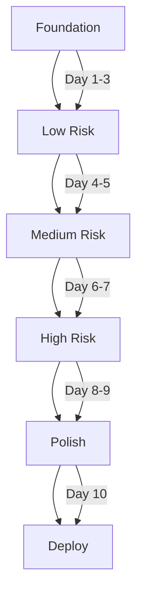

# Collapsible UI Implementation Plan

## Executive Summary

Refactor MainUI from a single scrollable panel into 11 collapsible sections with smart defaults, improving interface organization and user experience while maintaining all functionality.

**Key Benefits**:
- ✅ Reduced cognitive load with closed-by-default sections
- ✅ Faster access via keyboard shortcuts (Alt+1-9)
- ✅ Persistent state management across sessions
- ✅ Improved performance through lazy loading
- ✅ Mobile-friendly with touch-optimized interactions

## Technical Specifications

### Performance Requirements
- **Toggle Animation**: <100ms response time
- **State Persistence**: <50ms save/load operations
- **Memory Usage**: <5MB for UI state management
- **Lazy Loading**: Initialize controls only when first opened
- **Smooth Animations**: 60 FPS during transitions

### Browser Compatibility
- Chrome 90+, Firefox 88+, Safari 14+, Edge 90+
- Touch support for mobile devices
- Keyboard navigation fully accessible
- Screen reader compatible (ARIA labels)

### Design Constraints
- Maintain existing control IDs for backward compatibility
- Preserve all event listeners and data bindings
- CSS variables for theming consistency
- Maximum section height: 2000px (configurable)

## Architecture

### Current → Target State Transformation

| Aspect | Current State | Target State | Impact |
|--------|--------------|--------------|--------|
| **Structure** | Single scrollable panel | 11 collapsible sections | Cleaner UI |
| **Visibility** | All controls visible | Start closed, expand on demand | Reduced clutter |
| **State** | No persistence | localStorage + memory cache | Better UX |
| **Performance** | All controls initialized | Lazy loading on expand | Faster startup |
| **Navigation** | Scroll only | Keyboard shortcuts + click | Improved accessibility |

### Section Organization

```yaml
Sections:
  1. Presets:          Preset selection and management
  2. Particles:        Count, size, collision, distribution
  3. Physics:          Forces, friction, radius, pressure
  4. Noise:            Pattern generation and modulation
  5. Boundary:         Wall behavior and wrapping
  6. Forces:           Inter-species relationships
  7. Effects:          Visual enhancements (trails, glow)
  8. Colors:           Background and species colors
  9. Aspect Ratio:     Canvas dimensions control
  10. Mouse:           Interaction and shockwave (NEW)
  11. Configuration:   System settings and resets

## Implementation Components

### Core Classes

#### CollapsibleSection.js
```javascript
class CollapsibleSection {
    constructor(config) {
        this.id = config.id;
        this.title = config.title;
        this.icon = config.icon || '';
        this.content = config.content;
        this.isOpen = this.loadState() ?? config.defaultOpen ?? false;
        this.lazyLoad = config.lazyLoad ?? true;
        this.initialized = false;
        this.maxHeight = config.maxHeight || 2000;
        
        // DOM references
        this.element = null;
        this.headerElement = null;
        this.contentElement = null;
        this.toggleIcon = null;
    }
    
    render() {
        const section = document.createElement('div');
        section.className = 'collapsible-section';
        section.dataset.sectionId = this.id;
        
        // Header with icon, title, and chevron
        const header = this.createHeader();
        
        // Content wrapper with smooth transition
        const content = this.createContent();
        
        section.appendChild(header);
        section.appendChild(content);
        
        this.element = section;
        this.applyState(false); // No animation on initial render
        
        return section;
    }
    
    toggle(animate = true) {
        this.isOpen = !this.isOpen;
        this.applyState(animate);
        this.saveState();
        
        // Lazy load content on first open
        if (this.isOpen && !this.initialized && this.lazyLoad) {
            this.initializeContent();
        }
        
        // Dispatch event for external listeners
        this.element.dispatchEvent(new CustomEvent('sectionToggled', {
            detail: { id: this.id, isOpen: this.isOpen }
        }));
    }
    
    applyState(animate) {
        const content = this.contentElement;
        const icon = this.toggleIcon;
        
        if (this.isOpen) {
            if (animate) {
                content.style.maxHeight = content.scrollHeight + 'px';
            } else {
                content.style.maxHeight = this.maxHeight + 'px';
            }
            icon.classList.add('open');
            this.headerElement.classList.add('active');
        } else {
            content.style.maxHeight = '0';
            icon.classList.remove('open');
            this.headerElement.classList.remove('active');
        }
    }
    
    saveState() {
        const key = `collapsible_${this.id}`;
        localStorage.setItem(key, JSON.stringify(this.isOpen));
    }
    
    loadState() {
        const key = `collapsible_${this.id}`;
        const saved = localStorage.getItem(key);
        return saved ? JSON.parse(saved) : null;
    }
}
```

#### UIStateManager.js
```javascript
class UIStateManager {
    constructor() {
        this.sections = new Map();
        this.storageKey = 'particleLifeSynth_uiState';
        this.cache = new Map(); // Memory cache for performance
        this.saveDebounceTimer = null;
        this.saveDebounceDelay = 100; // ms
    }
    
    registerSection(section) {
        this.sections.set(section.id, section);
        this.cache.set(section.id, section.isOpen);
    }
    
    toggleSection(sectionId, animate = true) {
        const section = this.sections.get(sectionId);
        if (section) {
            section.toggle(animate);
            this.cache.set(sectionId, section.isOpen);
            this.debouncedSave();
        }
    }
    
    expandAll(animate = false) {
        this.sections.forEach(section => {
            if (!section.isOpen) section.toggle(animate);
        });
    }
    
    collapseAll(animate = false) {
        this.sections.forEach(section => {
            if (section.isOpen) section.toggle(animate);
        });
    }
    
    debouncedSave() {
        clearTimeout(this.saveDebounceTimer);
        this.saveDebounceTimer = setTimeout(() => {
            this.saveAllStates();
        }, this.saveDebounceDelay);
    }
    
    saveAllStates() {
        const states = {};
        this.cache.forEach((isOpen, id) => {
            states[id] = isOpen;
        });
        localStorage.setItem(this.storageKey, JSON.stringify(states));
    }
    
    loadAllStates() {
        const saved = localStorage.getItem(this.storageKey);
        if (saved) {
            const states = JSON.parse(saved);
            Object.entries(states).forEach(([id, isOpen]) => {
                this.cache.set(id, isOpen);
            });
        }
        return this.cache;
    }
}
```

### CSS Architecture

```css
.collapsible-section {
    margin-bottom: var(--space-md);
    background: var(--bg-secondary);
    border: 1px solid var(--border-default);
    border-radius: var(--radius-md);
    overflow: hidden;
    transition: all var(--transition-normal);
}

.collapsible-header {
    display: flex;
    align-items: center;
    justify-content: space-between;
    padding: var(--space-md) var(--space-lg);
    cursor: pointer;
    user-select: none;
    background: var(--bg-elevated);
    border-bottom: 1px solid var(--border-subtle);
    transition: background var(--transition-fast);
}

.collapsible-header:hover {
    background: var(--bg-hover);
}

.collapsible-header.active {
    border-bottom-color: var(--border-default);
}

.collapsible-toggle {
    display: flex;
    align-items: center;
    justify-content: center;
    width: 20px;
    height: 20px;
    color: var(--text-secondary);
    transition: transform var(--transition-fast);
}

.collapsible-toggle.open {
    transform: rotate(90deg);
}

.collapsible-content {
    max-height: 0;
    overflow: hidden;
    transition: max-height var(--transition-normal) ease-out;
}

.collapsible-content.open {
    max-height: 2000px; /* Large enough for content */
    transition: max-height var(--transition-normal) ease-in;
}

.collapsible-content-inner {
    padding: var(--space-lg);
}
```

#### Visual Indicators

```svg
<!-- Chevron Icon (Recommended) -->
<svg class="collapsible-toggle" width="12" height="12">
    <path d="M3 5l4 4 4-4" 
          fill="none" 
          stroke="currentColor" 
          stroke-width="1.5"/>
</svg>

<!-- CSS Rotation for Open State -->
.collapsible-toggle.open {
    transform: rotate(180deg);
}
```

### Section Configuration

```javascript
const SECTION_CONFIGS = [
    { id: 'presets', title: 'Presets', icon: '📦', priority: 1 },
    { id: 'particles', title: 'Particles', icon: '⚫', priority: 2 },
    { id: 'physics', title: 'Physics', icon: '⚙️', priority: 3 },
    { id: 'noise', title: 'Noise Patterns', icon: '〰️', priority: 4 },
    { id: 'boundary', title: 'Boundary Behavior', icon: '⬜', priority: 5 },
    { id: 'forces', title: 'Forces', icon: '🔄', priority: 6, lazyLoad: true },
    { id: 'effects', title: 'Effects', icon: '✨', priority: 7 },
    { id: 'colors', title: 'Colors', icon: '🎨', priority: 8 },
    { id: 'aspect-ratio', title: 'Aspect Ratio', icon: '📐', priority: 9 },
    { id: 'mouse', title: 'Mouse Interactions', icon: '🖱️', priority: 10 },
    { id: 'config', title: 'Configuration', icon: '⚡', priority: 11 }
];
```

### Integration Steps

#### 4.1 MainUI.js Refactoring

**Step 1: Add Collapsible Infrastructure**
```javascript
// Add to constructor
this.uiStateManager = new UIStateManager();
this.sections = new Map();

// Add to init()
this.initCollapsibleSections();
this.restoreUIState();
```

**Step 2: Wrap Existing Sections**
```javascript
initCollapsibleSections() {
    const sectionConfigs = [
        { id: 'presets', title: 'Presets', selector: '.presets-section' },
        { id: 'particles', title: 'Particles', selector: '.particles-section' },
        { id: 'physics', title: 'Physics', selector: '.physics-section' },
        { id: 'noise', title: 'Noise Patterns', selector: '.noise-section' },
        { id: 'boundary', title: 'Boundary Behavior', selector: '.boundary-section' },
        { id: 'forces', title: 'Forces', selector: '.forces-section' },
        { id: 'effects', title: 'Effects', selector: '.effects-section' },
        { id: 'colors', title: 'Colors', selector: '.colors-section' },
        { id: 'aspect-ratio', title: 'Aspect Ratio', selector: '.aspect-ratio-section' },
        { id: 'mouse-interactions', title: 'Mouse Interactions', selector: '.mouse-section' },
        { id: 'presets-config', title: 'Presets Configuration', selector: '.config-section' }
    ];
    
    sectionConfigs.forEach(config => {
        const section = new CollapsibleSection(
            config.id,
            config.title,
            this.getSectionContent(config.selector),
            false // Start closed
        );
        this.sections.set(config.id, section);
        this.uiStateManager.registerSection(section);
    });
}
```

**Step 3: Update HTML Generation**
```javascript
// Modify the init() method to generate collapsible structure
generateSectionHTML(id, title, contentHTML) {
    return `
        <div class="collapsible-section" data-section-id="${id}">
            <div class="collapsible-header" data-section-toggle="${id}">
                <h4 class="section-title">${title}</h4>
                <div class="collapsible-toggle">
                    <svg width="12" height="12" viewBox="0 0 12 12">
                        <path d="M3 5l4 4 4-4" fill="none" stroke="currentColor" stroke-width="1.5"/>
                    </svg>
                </div>
            </div>
            <div class="collapsible-content" data-section-content="${id}">
                <div class="collapsible-content-inner">
                    ${contentHTML}
                </div>
            </div>
        </div>
    `;
}
```

#### Event Handling & Keyboard Shortcuts

```javascript
setupCollapsibleEvents() {
    // Delegated click handler for performance
    this.container.addEventListener('click', (e) => {
        const header = e.target.closest('.collapsible-header');
        if (header) {
            const sectionId = header.dataset.sectionToggle;
            this.uiStateManager.toggleSection(sectionId);
        }
    });
    
    // Keyboard shortcuts with preventDefault
    document.addEventListener('keydown', (e) => {
        // Alt + 1-9: Toggle specific sections
        if (e.altKey && !e.shiftKey && !e.ctrlKey) {
            const num = parseInt(e.key);
            if (num >= 1 && num <= 9) {
                e.preventDefault();
                const sectionIds = Array.from(this.sections.keys());
                if (sectionIds[num - 1]) {
                    this.uiStateManager.toggleSection(sectionIds[num - 1]);
                }
            }
        }
        
        // Shift + E: Expand all sections
        if (e.shiftKey && e.key === 'E' && !e.altKey && !e.ctrlKey) {
            e.preventDefault();
            this.uiStateManager.expandAll(true);
        }
        
        // Shift + C: Collapse all sections  
        if (e.shiftKey && e.key === 'C' && !e.altKey && !e.ctrlKey) {
            e.preventDefault();
            this.uiStateManager.collapseAll(true);
        }
    });
    
    // Touch support for mobile
    let touchStartY = 0;
    this.container.addEventListener('touchstart', (e) => {
        touchStartY = e.touches[0].clientY;
    }, { passive: true });
    
    this.container.addEventListener('touchend', (e) => {
        const touchEndY = e.changedTouches[0].clientY;
        const deltaY = Math.abs(touchEndY - touchStartY);
        
        // Only toggle if it's a tap, not a swipe
        if (deltaY < 10) {
            const header = e.target.closest('.collapsible-header');
            if (header) {
                const sectionId = header.dataset.sectionToggle;
                this.uiStateManager.toggleSection(sectionId);
            }
        }
    }, { passive: true });
}
```

### Performance Optimizations

#### Lazy Loading Strategy

```javascript
class LazyLoadManager {
    constructor() {
        this.loadQueue = new Set();
        this.loaded = new Set();
        this.loading = new Set();
    }
    
    async loadSection(sectionId) {
        if (this.loaded.has(sectionId) || this.loading.has(sectionId)) {
            return;
        }
        
        this.loading.add(sectionId);
        
        try {
            switch(sectionId) {
                case 'forces':
                    await this.loadForceGraph();
                    break;
                case 'particles':
                    await this.loadDistributionDrawer();
                    break;
                case 'colors':
                    await this.loadColorPickers();
                    break;
                // Additional heavy components
            }
            
            this.loaded.add(sectionId);
        } finally {
            this.loading.delete(sectionId);
        }
    }
    
    async loadForceGraph() {
        // Dynamically import and initialize force graph
        const module = await import('./ForceGraph.js');
        return new module.ForceGraph();
    }
    
    async loadDistributionDrawer() {
        // Dynamically import distribution drawer
        const module = await import('./DistributionDrawer.js');
        return new module.DistributionDrawer();
    }
}
```

#### Animation Performance

```javascript
class AnimationOptimizer {
    constructor() {
        this.animationFrame = null;
        this.pendingAnimations = new Map();
    }
    
    scheduleAnimation(element, properties) {
        this.pendingAnimations.set(element, properties);
        
        if (!this.animationFrame) {
            this.animationFrame = requestAnimationFrame(() => {
                this.processPendingAnimations();
            });
        }
    }
    
    processPendingAnimations() {
        // Batch DOM updates
        this.pendingAnimations.forEach((properties, element) => {
            Object.assign(element.style, properties);
        });
        
        this.pendingAnimations.clear();
        this.animationFrame = null;
    }
}
```

### Migration Strategy

#### 6.1 Backward Compatibility

```javascript
// Maintain existing API surface
get controlsVisible() {
    return this.isVisible;
}

set controlsVisible(value) {
    this.isVisible = value;
    if (value) {
        // Open first section by default when showing controls
        const firstSection = Array.from(this.sections.keys())[0];
        if (firstSection && !this.sections.get(firstSection).isOpen) {
            this.toggleSection(firstSection);
        }
    }
}
```

#### Testing & Validation

**Functional Tests**:
- ✓ All controls maintain functionality post-refactor
- ✓ State persistence across page reloads
- ✓ Keyboard shortcuts (Alt+1-9, Shift+E/C)
- ✓ Touch interactions on mobile devices
- ✓ Lazy loading triggers correctly

**Performance Tests**:
- ✓ Toggle animation <100ms
- ✓ 60 FPS during transitions
- ✓ Memory usage <5MB for UI state
- ✓ No memory leaks on repeated toggles

**Compatibility Tests**:
- ✓ Chrome, Firefox, Safari, Edge support
- ✓ Mobile responsiveness (iOS/Android)
- ✓ Screen reader compatibility
- ✓ Keyboard-only navigation

### Memory Management

```javascript
class ResourceManager {
    constructor() {
        this.resources = new Map();
        this.cleanupThreshold = 10 * 60 * 1000; // 10 minutes
    }
    
    trackResource(sectionId, resource) {
        this.resources.set(sectionId, {
            resource,
            lastAccessed: Date.now()
        });
    }
    
    releaseUnusedResources() {
        const now = Date.now();
        
        this.resources.forEach((data, sectionId) => {
            const section = this.sections.get(sectionId);
            
            // Release resources for closed sections after threshold
            if (!section.isOpen && 
                (now - data.lastAccessed) > this.cleanupThreshold) {
                
                if (data.resource.cleanup) {
                    data.resource.cleanup();
                }
                
                this.resources.delete(sectionId);
            }
        });
    }
    
    // Run cleanup periodically
    startCleanupTimer() {
        setInterval(() => this.releaseUnusedResources(), 60000); // Every minute
    }
}
```

## Implementation Timeline

### Phase 1: Foundation (3 days)
**Day 1**: Core Classes
- [ ] Implement CollapsibleSection.js
- [ ] Implement UIStateManager.js
- [ ] Unit tests for both classes

**Day 2**: CSS & Animation
- [ ] Create collapsible.css with variables
- [ ] Implement smooth transitions
- [ ] Test animation performance

**Day 3**: Integration Prep
- [ ] Create section configuration
- [ ] Setup lazy loading infrastructure
- [ ] Prepare migration utilities

### Phase 2: Progressive Migration (5 days)
**Day 4-5**: Low-Risk Sections
- [ ] Migrate: Aspect Ratio, Noise, Colors
- [ ] Test each migration thoroughly
- [ ] Monitor performance metrics

**Day 6-7**: Medium-Risk Sections
- [ ] Migrate: Boundary, Effects, Mouse
- [ ] Implement lazy loading for Effects
- [ ] Validate touch interactions

**Day 8**: High-Risk Sections
- [ ] Migrate: Forces, Physics, Particles, Presets
- [ ] Implement lazy loading for heavy components
- [ ] Full regression testing

### Phase 3: Polish & Deploy (2 days)
**Day 9**: Optimization
- [ ] Performance profiling
- [ ] Memory leak detection
- [ ] Cross-browser testing

**Day 10**: Release
- [ ] Final QA pass
- [ ] Documentation update
- [ ] Production deployment

## Risk Mitigation Matrix

| Risk | Severity | Likelihood | Mitigation Strategy | Contingency |
|------|----------|------------|-------------------|-------------|
| **Breaking functionality** | High | Medium | • Incremental migration<br>• Comprehensive test suite<br>• Feature flags for rollback | Immediate rollback via git |
| **Performance degradation** | Medium | Low | • Lazy loading<br>• RAF for animations<br>• Performance monitoring | Disable animations if FPS < 30 |
| **State corruption** | High | Low | • Validation on save/load<br>• Schema versioning<br>• Backup to sessionStorage | Clear corrupted state, use defaults |
| **Mobile incompatibility** | Medium | Medium | • Touch event handlers<br>• Responsive design<br>• Device testing | Fallback to non-collapsible on small screens |
| **User confusion** | Low | Medium | • Gradual rollout<br>• Tutorial overlay<br>• Keyboard shortcut guide | Provide toggle for legacy UI (temporary) |

### Rollback Strategy

```javascript
// Feature flag for emergency rollback
const ENABLE_COLLAPSIBLE_UI = localStorage.getItem('enableCollapsibleUI') !== 'false';

if (!ENABLE_COLLAPSIBLE_UI) {
    // Load legacy UI
    this.loadLegacyUI();
} else {
    // Load new collapsible UI
    this.initCollapsibleSections();
}
```

## Success Metrics & KPIs

### Quantitative Metrics

| Metric | Target | Measurement Method |
|--------|--------|-------------------|
| **Toggle Response Time** | <100ms | Performance.now() timing |
| **Frame Rate** | 60 FPS | requestAnimationFrame monitoring |
| **Memory Usage** | <5MB increase | Chrome DevTools heap snapshot |
| **Initial Load Time** | <10% increase | Navigation Timing API |
| **State Save Time** | <50ms | localStorage write timing |

### Qualitative Metrics

| Metric | Target | Measurement Method |
|--------|--------|-------------------|
| **User Satisfaction** | >80% positive | User feedback survey |
| **Discoverability** | <30s to find control | User testing sessions |
| **Learning Curve** | <2min familiarization | New user onboarding |
| **Accessibility Score** | WCAG AA compliant | axe DevTools audit |
| **Code Maintainability** | >70 score | CodeClimate analysis |

### Monitoring Dashboard

```javascript
class PerformanceMonitor {
    constructor() {
        this.metrics = {
            toggleTimes: [],
            frameRates: [],
            memoryUsage: [],
            stateOperations: []
        };
    }
    
    trackToggle(duration) {
        this.metrics.toggleTimes.push(duration);
        if (duration > 100) {
            console.warn(`Slow toggle detected: ${duration}ms`);
        }
    }
    
    generateReport() {
        return {
            avgToggleTime: this.average(this.metrics.toggleTimes),
            p95ToggleTime: this.percentile(this.metrics.toggleTimes, 95),
            avgFrameRate: this.average(this.metrics.frameRates),
            memoryDelta: this.metrics.memoryUsage[this.metrics.memoryUsage.length - 1] - 
                        this.metrics.memoryUsage[0]
        };
    }
}
```

## Appendix: Implementation Reference

### A. Complete Section Configuration with Metadata

```javascript
const SECTION_CONFIGS = {
    presets: {
        title: 'Presets',
        icon: '📦',
        defaultOpen: false,
        controls: ['preset-selector', 'load-preset-btn', 'randomize-values-btn']
    },
    particles: {
        title: 'Particles',
        icon: '⚫',
        defaultOpen: false,
        controls: ['particles-per-species', 'species-count', 'distribution-canvas', 'species-size', 'collision-strength', 'collision-offset']
    },
    physics: {
        title: 'Physics',
        icon: '⚙️',
        defaultOpen: false,
        controls: ['force-strength', 'friction', 'social-radius', 'environmental-pressure']
    },
    noise: {
        title: 'Noise Patterns',
        icon: '〰️',
        defaultOpen: false,
        controls: ['noise-enabled', 'noise-pattern', 'noise-amplitude', 'noise-scale', 'noise-time-scale']
    },
    boundary: {
        title: 'Boundary Behavior',
        icon: '⬜',
        defaultOpen: false,
        controls: ['wrap-around-walls', 'wall-bounce', 'repulsive-force']
    },
    forces: {
        title: 'Forces',
        icon: '🔄',
        defaultOpen: false,
        controls: ['randomize-forces-btn', 'force-distribution', 'force-pattern-selector', 'from-species', 'to-species', 'force-graph-container']
    },
    effects: {
        title: 'Effects',
        icon: '✨',
        defaultOpen: false,
        controls: ['trails-enabled', 'trail-controls', 'per-species-halo-enabled', 'species-glow-enabled']
    },
    colors: {
        title: 'Colors',
        icon: '🎨',
        defaultOpen: false,
        controls: ['background-mode', 'background-color', 'species-colors-container']
    },
    aspectRatio: {
        title: 'Aspect Ratio',
        icon: '📐',
        defaultOpen: false,
        controls: ['aspect-ratio-enabled', 'aspect-ratio-controls']
    },
    mouseInteractions: {
        title: 'Mouse Interactions',
        icon: '🖱️',
        defaultOpen: false,
        controls: ['shockwave-enabled', 'shockwave-strength', 'shockwave-size', 'shockwave-falloff']
    },
    presetsConfiguration: {
        title: 'Presets Configuration',
        icon: '⚡',
        defaultOpen: false,
        controls: ['configure-preset-btn', 'reset-defaults-btn']
    }
};
```

### B. Critical Utility Functions

```javascript
// Debounced state saving for performance
function debounce(func, delay) {
    let timeoutId;
    return function(...args) {
        clearTimeout(timeoutId);
        timeoutId = setTimeout(() => func.apply(this, args), delay);
    };
}

// Safe element query with error handling
function safeQuerySelector(selector, parent = document) {
    try {
        return parent.querySelector(selector);
    } catch (e) {
        console.error(`Invalid selector: ${selector}`, e);
        return null;
    }
}

// Smooth scroll to section
function scrollToSection(sectionId) {
    const element = document.querySelector(`[data-section-id="${sectionId}"]`);
    if (element) {
        element.scrollIntoView({ 
            behavior: 'smooth', 
            block: 'start',
            inline: 'nearest'
        });
    }
}

// Performance-optimized class toggle
function toggleClasses(element, classMap) {
    const classList = element.classList;
    Object.entries(classMap).forEach(([className, shouldAdd]) => {
        classList.toggle(className, shouldAdd);
    });
}
```

### C. Error Handling & Recovery

```javascript
class ErrorBoundary {
    constructor() {
        this.errors = [];
        this.maxErrors = 10;
    }
    
    catch(error, context) {
        this.errors.push({ error, context, timestamp: Date.now() });
        
        // Prevent memory leak
        if (this.errors.length > this.maxErrors) {
            this.errors.shift();
        }
        
        // Log to console in development
        if (process.env.NODE_ENV === 'development') {
            console.error(`[${context}]:`, error);
        }
        
        // Recovery based on context
        switch(context) {
            case 'section-toggle':
                this.recoverSectionToggle();
                break;
            case 'state-save':
                this.recoverStateSave();
                break;
            default:
                this.genericRecovery();
        }
    }
    
    recoverSectionToggle() {
        // Reset to stable state
        this.uiStateManager.loadAllStates();
    }
    
    recoverStateSave() {
        // Fallback to sessionStorage
        sessionStorage.setItem('backup_state', JSON.stringify(this.cache));
    }
}
```

## Implementation Roadmap

### Incremental Migration Strategy



### Section Migration Order

| Priority | Section | Risk Level | Dependencies | Lazy Load |
|----------|---------|------------|--------------|----------|
| 1 | Aspect Ratio | Low | None | No |
| 2 | Noise Patterns | Low | None | No |
| 3 | Colors | Low | ColorPicker | Yes |
| 4 | Boundary | Low | None | No |
| 5 | Effects | Medium | Canvas | No |
| 6 | Mouse | Medium | None | No |
| 7 | Forces | High | ForceGraph | Yes |
| 8 | Physics | High | Core System | No |
| 9 | Particles | High | DistributionDrawer | Yes |
| 10 | Presets | Critical | PresetManager | No |
| 11 | Configuration | Low | None | No |

### Go/No-Go Criteria

**Before Each Migration Phase**:
- ✓ Previous phase tests passing
- ✓ Performance metrics within targets
- ✓ No critical bugs reported
- ✓ Rollback mechanism tested

**Final Deployment Checklist**:
- ✓ All sections successfully migrated
- ✓ Performance targets met (see Success Metrics)
- ✓ Cross-browser testing complete
- ✓ Mobile experience validated
- ✓ Accessibility audit passed
- ✓ Documentation updated
- ✓ Rollback plan documented

### Next Steps

1. **Immediate**: Create `CollapsibleSection.js` and `UIStateManager.js`
2. **Day 1**: Implement and test on Aspect Ratio section
3. **Day 2-3**: Complete CSS and animation system
4. **Day 4+**: Begin progressive migration following order above
5. **Continuous**: Monitor metrics, gather feedback, iterate

## Status: READY FOR IMPLEMENTATION ✅

---

*Document Version: 2.0*  
*Last Updated: [Current Date]*  
*Author: Particle Life Synth Team*  
*Review Status: Approved for Implementation*